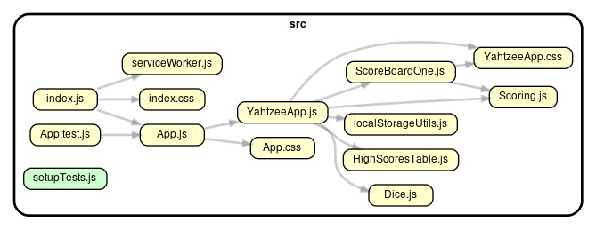
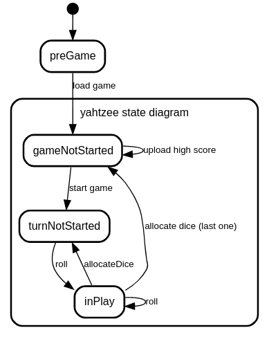

# Yahtzee in react

This project was bootstrapped with [Create React App](https://github.com/facebook/create-react-app).

### dependency graph

generated with [dependency-cruiser](https://github.com/sverweij/dependency-cruiser/)

### A couple of state transition diagrams

#### hand-drawn

#### from rules

(generated with [State Machine cat](https://github.com/sverweij/state-machine-cat/)) - [online version](https://state-machine-cat.js.org/) using ...

[state transition diagram rules](./public/yahtzee-state-diagram-2-rules.txt)
